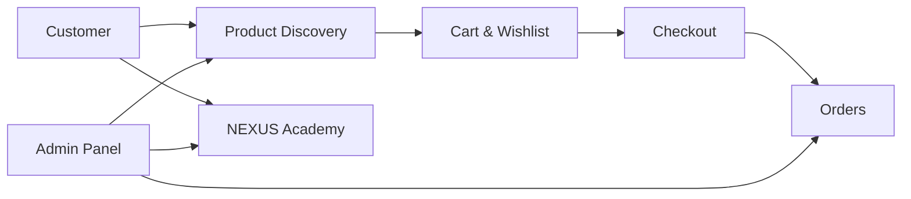
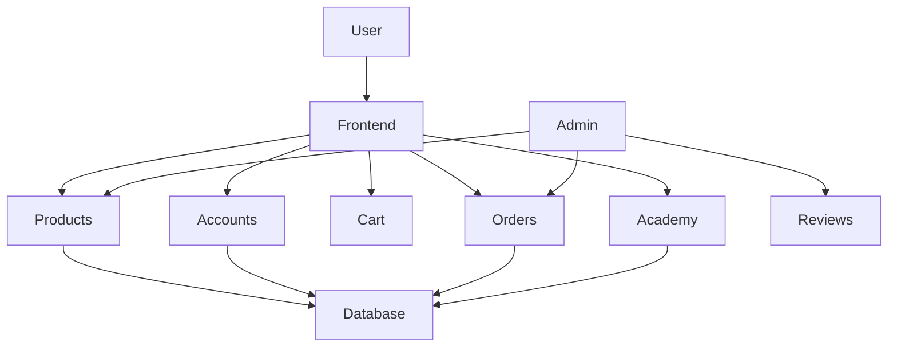
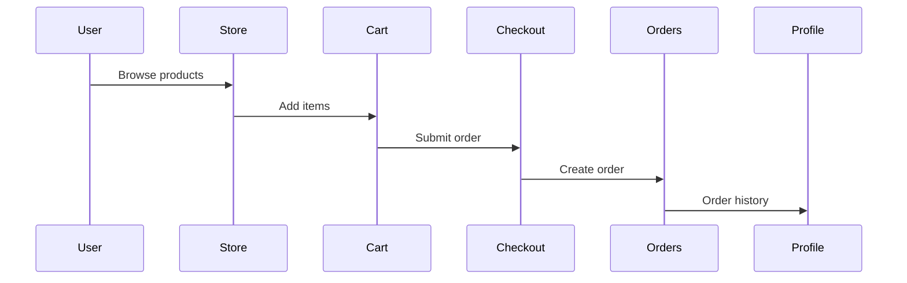
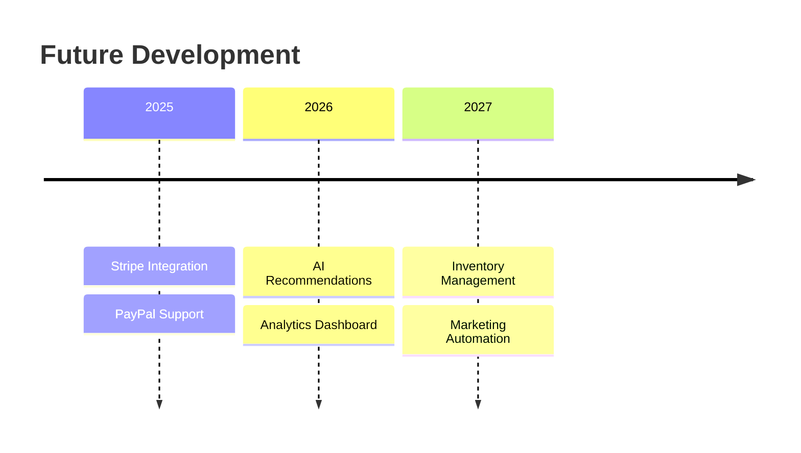

# NEXUS Store

<p align="center">
  
</p>

<h1 align="center">NEXUS Store</h1>

<p align="center">
Production-ready Django e-commerce platform.
</p>

<p align="center">
  
  
  
  
  
</p>

---

## Experience

<p align="center">



</p>

---

## Overview

NEXUS Store is a full-stack Django commerce platform combining shopping, editorial content, customer accounts, and administration tools inside a unified ecosystem.

It delivers a premium shopping experience with modern UI patterns, scalable architecture, and production-ready workflows.

---

## Highlights

| Feature           | Included |
| ----------------- | -------- |
| Product Catalog   | ✅        |
| Cart Persistence  | ✅        |
| Wishlist          | ✅        |
| User Accounts     | ✅        |
| Reviews & Ratings | ✅        |
| Order History     | ✅        |
| Academy Blog      | ✅        |
| Search & Filters  | ✅        |
| Admin Dashboard   | ✅        |
| SEO Meta Tags     | ✅        |
| Responsive Design | ✅        |
| Automated Tests   | ✅        |

---

# Features

<table>
<tr>
<td width="50%">

### 🛍 Commerce

* Product catalog
* Product galleries
* Deals of the Day
* Search
* Sorting
* Filtering
* Cart system
* Wishlist

</td>
<td width="50%">

### 👤 Customer

* Authentication
* Profiles
* Order history
* Reviews
* Ratings
* Review moderation

</td>
</tr>

<tr>
<td>

### 📰 Academy

* Buying guides
* Product reviews
* Editorial articles
* Content management

</td>

<td>

### ⚙ Administration

* Product management
* Image uploads
* Order management
* Review approval
* Employee dashboard

</td>
</tr>
</table>

---

# Technology Stack

| Layer          | Technology              |
| -------------- | ----------------------- |
| Backend        | Django                  |
| Language       | Python                  |
| Database       | SQLite / PostgreSQL     |
| Frontend       | HTML · CSS · JavaScript |
| Authentication | Django Auth             |
| Testing        | Django Test Framework   |
| Deployment     | Gunicorn · Nginx        |

---

# System Architecture



---

# Product Dataset

| Category    | Products |
| ----------- | -------: |
| Smartphones |       10 |
| Laptops     |       10 |
| Cameras     |       10 |
| **Total**   |   **30** |

Each product includes:

* Multiple images
* Ratings
* Reviews
* Pricing
* Discounts
* Categories

---

# Screens

| Home              | Products  | Academy       |
| ----------------- | --------- | ------------- |
| Hero Banner       | Filtering | Articles      |
| Featured Products | Search    | Buying Guides |
| Trust Section     | Sorting   | Reviews       |

---

# Project Structure

```text
nexus_store/
│
├── accounts/
├── academy/
├── store/
├── orders/
├── static/
├── templates/
├── media/
├── tests/
│
├── manage.py
└── requirements.txt
```

---

# Quick Start

```bash
pip install -r requirements.txt

python manage.py migrate

python manage.py seed_data

python manage.py runserver
```

Open:

```text
http://127.0.0.1:8000
```

---

# Demo Accounts

| Role  | Username | Password |
| ----- | -------- | -------- |
| Admin | admin    | admin123 |
| Demo  | demo     | demo123  |

Admin panel:

```text
http://127.0.0.1:8000/admin
```

---

# Application Flow



---

# Testing

```bash
python manage.py test
```

### Test Status

| Tests | Status    |
| ----: | --------- |
|   119 | ✅ Passing |

---

# Production Checklist

| Task               | Status |
| ------------------ | ------ |
| DEBUG=False        | ⬜      |
| PostgreSQL         | ⬜      |
| Stripe Integration | ⬜      |
| PayPal Integration | ⬜      |
| Email Service      | ⬜      |
| collectstatic      | ⬜      |
| Gunicorn           | ⬜      |
| Nginx              | ⬜      |
| HTTPS              | ⬜      |

---

# Design Principles

| Principle | Description             |
| --------- | ----------------------- |
| Discover  | Fast product discovery  |
| Decide    | Trusted information     |
| Purchase  | Seamless checkout       |
| Scale     | Production architecture |

---

# Roadmap



---

# Deployment

```bash
python manage.py collectstatic

gunicorn nexus.wsgi

nginx
```

Supported platforms:

* Railway
* Render
* DigitalOcean
* AWS
* Heroku

---

# Repository Assets

```text
assets/
│
├── banner.png
├── thumbnail.png
├── homepage.png
├── products.png
├── academy.png
├── architecture.svg
└── workflow.svg
```

---

<p align="center">

### Built with Django. Designed like a product.

</p>
